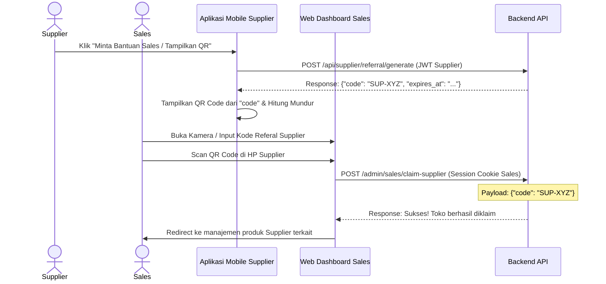

# 📑 Panduan Integrasi Frontend: Fitur Referal & Klaim Supplier oleh Sales

Dokumen ini menjelaskan spesifikasi API dan petunjuk antarmuka (UI/UX) untuk pengembang **Aplikasi Mobile (Supplier)** dan **Web Dashboard (Sales)** untuk mengintegrasikan fitur kode referal dinamis serta pengelolaan produk terkelola.

---

## 🔄 Alur Kerja Utama (Workflow)



---

## 📱 1. Integrasi Aplikasi Mobile (Supplier)
**Tujuan**: Supplier menghasilkan kode dinamis untuk dipindai oleh Sales yang membantunya di lapangan.

### A. Generate Kode Referal Dinamis
*   **URL**: `/api/supplier/referral/generate`
*   **Method**: `POST`
*   **Headers**: 
    *   `Authorization: Bearer <JWT_TOKEN_SUPPLIER>`
    *   `Accept: application/json`
*   **Request Body**: *Kosong (Empty)*
*   **Contoh Response Sukses (200 OK)**:
    ```json
    {
      "status": true,
      "message": "Kode referal berhasil dibuat.",
      "data": {
        "code": "SUP-B8F3C9",
        "expires_at": "2026-07-01 13:50:00"
      }
    }
    ```
*   **Tindakan Frontend (Mobile App)**:
    1. Ambil nilai `code` dari JSON response (misal: `"SUP-B8F3C9"`).
    2. Render nilai tersebut menjadi **QR Code** atau **Barcode** di tengah layar aplikasi.
    3. Tampilkan teks kode `"SUP-B8F3C9"` di bawah QR Code agar Sales dapat mengetikkannya secara manual jika kamera tidak berfungsi.
    4. Tampilkan hitung mundur waktu kedaluwarsa secara dinamis di layar menggunakan nilai `expires_at` (kode otomatis kedaluwarsa setelah 10 menit).

---

## 💻 2. Integrasi Web Dashboard (Sales)
**Tujuan**: Sales masuk ke Web Dashboard, memindai QR Code supplier, dan mulai memasukkan produk untuk supplier tersebut.

### A. Login Web Dashboard
*   Sales login menggunakan menu login administrator umum di `/admin/login` dengan akun ber-role `'sales'`.
*   Backend secara otomatis menerbitkan cookie `admin_jwt` untuk menangani sesi autentikasi.

### B. Hubungkan / Klaim Akun Supplier
*   **Halaman**: Menu **"Klaim Toko Supplier Baru"**.
*   **Aksi UI**: 
    *   Sales membuka pemindai kamera (QR Scanner) dari browser untuk men-scan layar HP Supplier, OR
    *   Sales mengetikkan secara manual kode teks 10-karakter (misal: `"SUP-B8F3C9"`) yang tertera di HP Supplier.
*   **Request API**:
    *   **URL**: `/admin/sales/claim-supplier`
    *   **Method**: `POST`
    *   **Headers**: `Accept: application/json` (Kredensial sesi otomatis dikirim via cookie)
    *   **Body (JSON / Form-Data)**:
        ```json
        {
          "code": "SUP-B8F3C9"
        }
        ```
*   **Contoh Response Sukses (200 OK)**:
    ```json
    {
      "status": true,
      "message": "Supplier berhasil dihubungkan.",
      "data": {
        "supplier_id": 12,
        "supplier_name": "Toko Besi & Baja Sejahtera"
      }
    }
    ```
*   **Contoh Response Gagal (400 Bad Request)**:
    ```json
    {
      "status": 400,
      "error": 400,
      "messages": {
        "error": "Kode referal telah kedaluwarsa."
      }
    }
    ```

### C. Menambahkan Produk Atas Nama Supplier yang Diklaim
Setelah supplier berhasil terhubung, Sales dapat membantu mengisi produk toko tersebut.
*   **URL**: `/api/products`
*   **Method**: `POST`
*   **Content-Type**: `multipart/form-data`
*   **Body (Form-Data)**:
    *   Kirimkan seluruh parameter produk seperti biasa (`name`, `price`, `stock`, `description`, `photo`).
    *   **Wajib Tambahkan Field**: 
        *   `supplier_id`: `<ID_SUPPLIER_YANG_DIKLAIM>` (misal: `12`)

### D. Mengubah / Mengedit Produk Terkelola
*   **URL**: `/api/products/{product_id}` (misal: `/api/products/45`)
*   **Method**: `POST` *(Gunakan POST multipart untuk kelancaran unggah foto)*
*   **Content-Type**: `multipart/form-data`
*   **Body (Form-Data)**:
    *   Kirimkan field yang ingin diubah.
    *   **Wajib Tambahkan Field**: 
        *   `supplier_id`: `<ID_SUPPLIER_YANG_DIKLAIM>` (misal: `12`)

> ⚠️ **Catatan Keamanan**: Backend secara otomatis memvalidasi apakah Supplier tersebut benar dikelola oleh Sales yang sedang login. Jika Sales mencoba mengirimkan `supplier_id` milik toko lain yang tidak ia klaim, backend akan mengembalikan status `403 Forbidden` / `Unauthorized` dan menolak perubahan.
